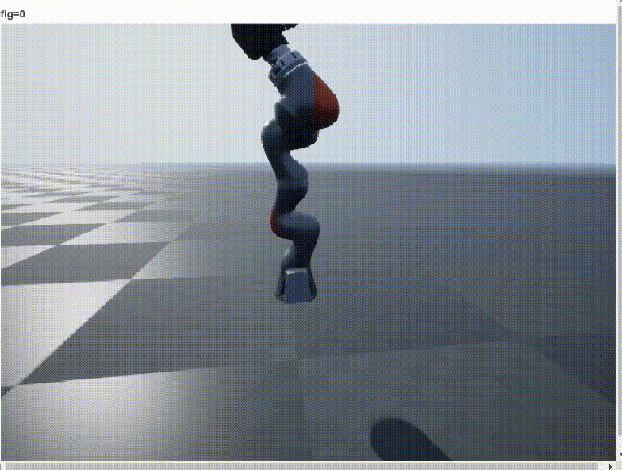
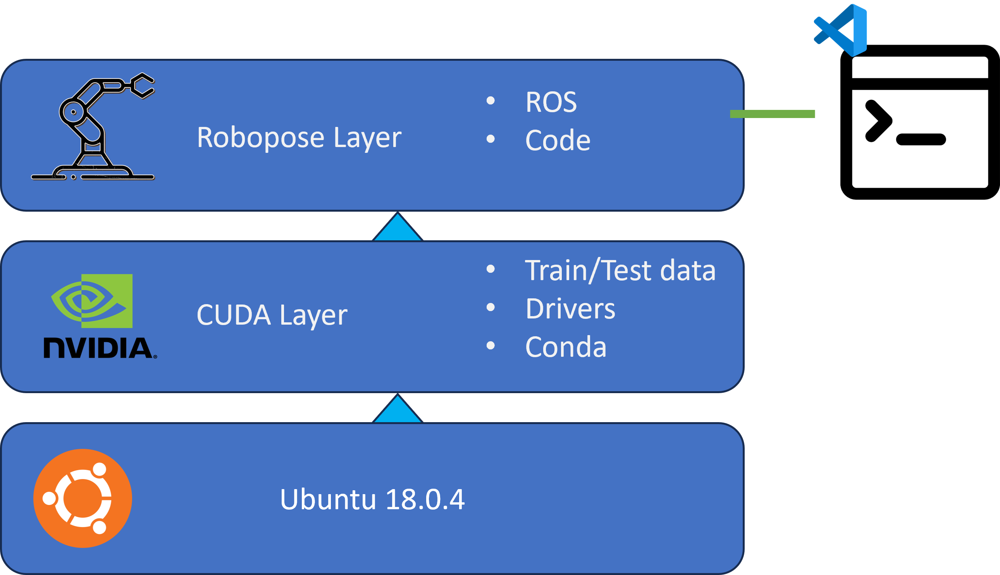

<h1 align="center">
Single-view robot pose and joint angle estimation via render & compare
</h1>

<div align="center">
<h3>
<a href="http://ylabbe.github.io">Yann Labbé</a>,
<a href="https://jcarpent.github.io/">Justin Carpentier</a>,
<a href="http://imagine.enpc.fr/~aubrym/">Mathieu Aubry</a>,
<a href="http://www.di.ens.fr/~josef/">Josef Sivic</a>
<br>
<br>
CVPR: Conference on Computer Vision and Pattern Recognition, 2021 (Oral)
<br>
<br>
<a href="https://arxiv.org/abs/2104.09359">[Paper]</a>
<a href="https://www.di.ens.fr/willow/research/robopose/">[Project page]</a>
<!-- <a href="https://youtu.be/xxxx">[Video (5 min)]</a> -->
<a href="https://youtu.be/3yzwS99sgLI">[Supplementary Video]</a>
<!-- <a href="https://docs.google.com/presentation/d/xxxxx">[Slides]</a> -->
</h3>
</div>


**RoboPose.** (a) Given a single RGB image of a known articulated robot in an unknown configuration (left), RoboPose estimates the joint   angles and the 6D camera-to-robot pose (rigid translation and rotation) providing the complete state of the robot within the 3D scene, here illustrated by overlaying the articulated CAD model of the robot over the input image (right). (b) When the joint angles are known at test-time (e.g. from internal measurements of the robot), RoboPose can use them as an additional input to estimate the 6D camera-to-robot pose to enable, for example, visually guided manipulation without fiducial markers.

# Overview
This repository forked from the original [robopose repository](https://github.com/ylabbe/robopose) and extends its support be introducing a docker structure which runs most of the code. 
The docker container runs robopose using an `ubuntu 18.04` subsystem which also automatically installs all the necessary drivers, the cuda toolkit. It is even possible to code in real time wihtin docker using VS Codes DevContainer utilities.


 

# Setup 
For this project `Ubuntu 22.04.3 LTS` was used together with CPU:`AMD® Ryzen 9 3900x ` and  GPU:`Nvidia GeForce RTX 3070`. The project was coded in `VSCode 1.85`(this is important for the devcontainer). The host machine already had the nvidia driver `525.147.05` installed.


# Installation and Docker Setup
```
git clone --recurse-submodules https://github.com/ylabbe/robopose.git
cd robopose
conda env create -n robopose --file environment.yaml
conda activate robopose
python setup.py install
mkdir local_data
```
Within the robopose environment you must now download the datasets or the pretrained models if you want to, this data will then be copied into the docker container. This is done because the download scripts won't execute that well within the docker container.



## Docker Setup

Now the first docker image must be created
```
docker build -t cuda_image . 
```

This will take some time, since the datasets, the pretrained models will be copied into the container, several packages are installed and another robopose env is created within the container.
You can check if the image is created correctly using `docker images`.

Now run
```
cd robopose
docker build -t robopose_img . 
```
This will build a docker image on top of the other docker image. It is done because a developer will most likely change the code section of this projcet and this structure makes sure that the whole image is created from scratch. If something is changes within the code section and you want it to be in the container when you first open it you can delete the image and rebuild it.

Finally to develop within the container run:
```
sudo docker run --shm-size=60g --rm --runtime=nvidia --gpus all -it robopose_img:latest
```

If there is something changed within the docker container and you want to execute a job via the job runner, reset the `job_runner` file and execute the `setup.py`
```
runjob-config job-runner-config.yaml 
python setup.py install 
```

The installation may take some time as several packages must be downloaded and installed/compiled. If you plan to change the code, run `python setup.py develop`.

# Downloading and preparing data

All data used (datasets, models, results, ...) are stored in a directory `local_data` at the root of the repository. Create it with `mkdir local_data` or use a symlink if you want the data to be stored at a different place. We provide the utility `robopose/scripts/download.py` for downloading required data and models. All of the files can also be [downloaded manually](https://drive.google.com/drive/folders/1Mk8AKk49NdNb4Cu_6deGd6IFJAoRy40f?usp=sharing).


## Robot URDF & CAD models
```
python -m robopose.scripts.download --robot=owi
python -m robopose.scripts.download --robot=kuka
python -m robopose.scripts.download --robot=panda
python -m robopose.scripts.download --robot=baxter
```

## DREAM & CRAVES Datasets
```
python -m robopose.scripts.download --datasets=craves.test
python -m robopose.scripts.download --datasets=dream.test

# Only for re-training the models
python -m robopose.scripts.download --datasets=craves.train
python -m robopose.scripts.download --datasets=dream.train
```

## Pre-trained models
```
python -m robopose.scripts.download --model=panda-known_angles
python -m robopose.scripts.download --model=panda-predict_angles
python -m robopose.scripts.download --model=kuka-known_angles
python -m robopose.scripts.download --model=kuka-predict_angles
python -m robopose.scripts.download --model=baxter-known_angles
python -m robopose.scripts.download --model=baxter-predict_angles
python -m robopose.scripts.download --model=owi-predict_angles
```

## DREAM & CRAVES original results
```
python -m robopose.scripts.download --dream_paper_results
python -m robopose.scripts.download --craves_paper_results
```

Notes:
- Dream results were extracted using the official code from https://github.com/NVlabs/DREAM.
- CRAVES results were extracted using the code provided with the [paper](https://github.com/zuoym15/craves.ai). We slightly modified this code to compute the errors on the whole LAB dataset, the code used can be found on our [fork](https://github.com/ylabbe/craves_robopose).

# Note on GPU parallelization

Training and evaluation code can be parallelized across multiple gpus and multiple machines using vanilla `torch.distributed`. This is done by simply starting multiple processes with the same arguments and assigning each process to a specific GPU via `CUDA_VISIBLE_DEVICES`. To run the processes on a local machine or on a SLURM cluster, we use our own utility [job-runner](https://github.com/ylabbe/job-runner) but other similar tools such as [dask-jobqueue](https://github.com/dask/dask-jobqueue) or [submitit](https://github.com/facebookincubator/submitit) could be used. We provide instructions for single-node multi-gpu training, and for multi-gpu multi-node training on a SLURM cluster.

## Single gpu on a single node
```
# CUDA ID of GPU you want to use
export CUDA_VISIBLE_DEVICES=0
python -m robopose.scripts.example_multigpu
```
where `scripts.example_multigpu` can be replaced by `scripts.run_pose_training` or `scripts.run_robopose_eval` (see below for usage of training/evaluation scripts).

## Configuration of `job-runner` for multi-gpu usage
Change the path to the code directory, anaconda location and specify a temporary directory for storing job logs by modifying `job-runner-config.yaml'. If you have access to a SLURM cluster, specify the name of the queue, it's specifications (number of GPUs/CPUs per node) and the flags you typically use in a slurm script. Once you are done, run:
```
runjob-config job-runner-config.yaml
```

## Multi-gpu on a single node
```
# CUDA IDS of GPUs you want to use
export CUDA_VISIBLE_DEVICES=0,1
runjob --ngpus=2 --queue=local python -m robopose.scripts.example_multigpu
```
The logs of the first process will be printed. You can check the logs of the other processes in the job directory.

## On a SLURM cluster
```
runjob --ngpus=8 --queue=gpu_p1  python -m robopose.scripts.example_multigpu
```

# Reproducing results using pre-trained models
We provide the inference results on all datasets to reproduce the results from the paper. You can download these results, generate the tables and qualitative visualization of our predictions on the test datasets. The results will be downloaded to `local_data/results`.

## Downloading inference results
```
# Table 1, DREAM paper results (converted from the original format)
python -m robopose.scripts.download --results=dream-paper-all-models

# Table 1, DREAM Known joint angles
python -m robopose.scripts.download --results=dream-known-angles

# Table 1, DREAM Unknown joint angles
python -m robopose.scripts.download --results=dream-unknown-angles

# Table 2, Iterative results
python -m robopose.scripts.download --results=panda-orb-known-angles-iterative

# Table 3, Craves-Lab
python -m robopose.scripts.download --results=craves-lab

# Table 4, Craves Youtube
python -m robopose.scripts.download --results=craves-youtube

# Table 5, Analysis of the choice of reference point
python -m robopose.scripts.download --results=panda-reference-point-ablation

# Table 6, Analysis of the choice of the anchor part
python -m robopose.scripts.download --results=panda-anchor-ablation

# Sup. Mat analysis of the number of iterations
python -m robopose.scripts.download --results=panda-train_iterations-ablation
```

You can generate the numbers from the tables from these inference/evaluation results using the notebook  `notebooks/generate_results.ipynb`.

You can generate visualization of the results using the notebook `notebooks/visualize_predictions.ipynb`.


## Running inference
We provide the code for running inference and re-generate all results. This is done using the `run_robot_eval` script. 
The results were obtained using the following commands:

```
## Main results and comparisons
# DREAM datasets,  DREAM models
runjob --ngpus=8  python scripts/run_robot_eval.py --datasets=dream-panda  --model=dream-all-models --id 1804
runjob --ngpus=8  python scripts/run_robot_eval.py --datasets=dream-baxter --model=dream-all-models --id 1804
runjob --ngpus=8  python scripts/run_robot_eval.py --datasets=dream-kuka  --model=dream-all-models --id 1804

# DREAM datasets, ours (known joints)
runjob --ngpus=8  python scripts/run_robot_eval.py --datasets=dream-panda  --model=knownq --id 1804
runjob --ngpus=8  python scripts/run_robot_eval.py --datasets=dream-baxter --model=knownq --id 1804
runjob --ngpus=8  python scripts/run_robot_eval.py --datasets=dream-kuka   --model=knownq --id 1804

# DREAM datasets, ours (unknown joints)
runjob --ngpus=8  python scripts/run_robot_eval.py --datasets=dream-panda  --model=unknownq --id 1804
runjob --ngpus=8  python scripts/run_robot_eval.py --datasets=dream-baxter --model=unknownq --id 1804
runjob --ngpus=8  python scripts/run_robot_eval.py --datasets=dream-kuka   --model=unknownq --id 1804

# CRAVES LAB dataset
runjob --ngpus=8 python scripts/run_robot_eval.py --datasets=craves-lab --model=unknownq --id 1804

# CRAVES Youtube dataset
runjob --ngpus=8  python scripts/run_robot_eval.py --datasets=craves-youtube --model=unknownq-focal=500 --id 1804
runjob --ngpus=8  python scripts/run_robot_eval.py --datasets=craves-youtube --model=unknownq-focal=750 --id 1804
runjob --ngpus=8  python scripts/run_robot_eval.py --datasets=craves-youtube --model=unknownq-focal=1000 --id 1804
runjob --ngpus=8  python scripts/run_robot_eval.py --datasets=craves-youtube --model=unknownq-focal=1250 --id 1804
runjob --ngpus=8  python scripts/run_robot_eval.py --datasets=craves-youtube --model=unknownq-focal=1500 --id 1804
runjob --ngpus=8  python scripts/run_robot_eval.py --datasets=craves-youtube --model=unknownq-focal=1750 --id 1804
runjob --ngpus=8  python scripts/run_robot_eval.py --datasets=craves-youtube --model=unknownq-focal=2000 --id 1804
runjob --ngpus=8  python scripts/run_robot_eval.py --datasets=craves-youtube --model=unknownq-focal=5000 --id 1804


## Ablations
# Online evaluation, Table 2
runjob --ngpus=8 python scripts/run_robot_eval.py --datasets=dream-panda-orb --model=knownq --id 1804 --eval_all_iter
runjob --ngpus=1 python scripts/run_robot_eval.py --datasets=dream-panda-orb --model=knownq-online --id 1804

# Analysis of reference point, Table 5
python -m robopose.scripts.download --models=ablation_reference_point
runjob --ngpus=8  python scripts/run_robot_eval.py --datasets=dream-panda-orb  --model=knownq-link0 --id 1804
runjob --ngpus=8  python scripts/run_robot_eval.py --datasets=dream-panda-orb  --model=knownq-link1 --id 1804
runjob --ngpus=8  python scripts/run_robot_eval.py --datasets=dream-panda-orb  --model=knownq-link5 --id 1804
runjob --ngpus=8  python scripts/run_robot_eval.py --datasets=dream-panda-orb  --model=knownq-link2 --id 1804
runjob --ngpus=8  python scripts/run_robot_eval.py --datasets=dream-panda-orb  --model=knownq-link4 --id 1804
runjob --ngpus=8  python scripts/run_robot_eval.py --datasets=dream-panda-orb  --model=knownq-link9 --id 1804

# Analysis of anchor part, Table 6
python -m robopose.scripts.download --models=ablation_anchor
runjob --ngpus=8  python scripts/run_robot_eval.py --datasets=dream-panda-orb  --model=unknownq-link1 --id 1804
runjob --ngpus=8  python scripts/run_robot_eval.py --datasets=dream-panda-orb  --model=unknownq-link2 --id 1804
runjob --ngpus=8  python scripts/run_robot_eval.py --datasets=dream-panda-orb  --model=unknownq-link5 --id 1804
runjob --ngpus=8  python scripts/run_robot_eval.py --datasets=dream-panda-orb  --model=unknownq-link0 --id 1804
runjob --ngpus=8  python scripts/run_robot_eval.py --datasets=dream-panda-orb  --model=unknownq-link4 --id 1804
runjob --ngpus=8  python scripts/run_robot_eval.py --datasets=dream-panda-orb  --model=unknownq-link9 --id 1804
runjob --ngpus=8  python scripts/run_robot_eval.py --datasets=dream-panda-orb  --model=unknownq-random_all --id 1804
runjob --ngpus=8  python scripts/run_robot_eval.py --datasets=dream-panda-orb  --model=unknownq-random_top5 --id 1804
runjob --ngpus=8  python scripts/run_robot_eval.py --datasets=dream-panda-orb  --model=unknownq-random_top3 --id 1804

# Analysis of number of iterations, Supplementary Material.
python -m robopose.scripts.download --models=ablation_train_iterations
runjob --ngpus=8  python scripts/run_robot_eval.py --datasets=dream-panda-orb  --model=train_K=1 --id 1804
runjob --ngpus=8  python scripts/run_robot_eval.py --datasets=dream-panda-orb  --model=train_K=2 --id 1804
runjob --ngpus=8  python scripts/run_robot_eval.py --datasets=dream-panda-orb  --model=train_K=3 --id 1804
runjob --ngpus=8  python scripts/run_robot_eval.py --datasets=dream-panda-orb  --model=train_K=5 --id 1804
```

## Re-training the models
We provide all the training code.

### Background images for data augmentation
We apply data augmentation to the training images. Data augmentation includes pasting random images of the pascal VOC dataset on the background of the scenes. You can download Pascal VOC using the following commands:
```
cd local_data
wget http://host.robots.ox.ac.uk/pascal/VOC/voc2012/VOCtrainval_11-May-2012.tar
tar -xvf VOCtrainval_11-May-2012.tar
```
(If the website is down, which happens periodically, you can alternatively download these files from  [a mirror](https://pjreddie.com/projects/pascal-voc-dataset-mirror/) at https://pjreddie.com/media/files/VOCtrainval_11-May-2012.tar)

### Reproducing models from the paper
```
runjob --ngpus=44  python scripts/run_articulated_training.py --config=dream-panda-gt_joints
runjob --ngpus=44  python scripts/run_articulated_training.py --config=dream-panda-predict_joints

runjob --ngpus=44  python scripts/run_articulated_training.py --config=dream-baxter-gt_joints
runjob --ngpus=44  python scripts/run_articulated_training.py --config=dream-baxter-predict_joints

runjob --ngpus=44  python scripts/run_articulated_training.py --config=dream-kuka-gt_joints
runjob --ngpus=44  python scripts/run_articulated_training.py --config=dream-kuka-predict_joints

runjob --ngpus=44  python scripts/run_articulated_training.py --config=craves-owi535-predict_joints
```

# Citation
If you use this code in your research, please cite the paper:

```
@inproceedings{labbe2021robopose,
title= {Single-view robot pose and joint angle estimation via render & compare}
author={Y. {Labb\'e} and J. {Carpentier} and M. {Aubry} and J. {Sivic}},
booktitle={Proceedings of the Conference on Computer Vision and Pattern Recognition (CVPR)},
year={2021}}
```